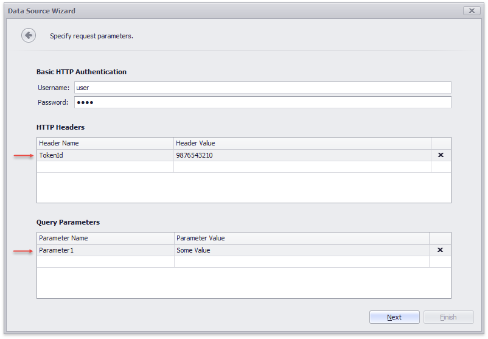

# How to Provide Predefined JsonDataSource Header Parameters in Wizards

When you use the **Report Wizard** / **Data Source Wizard** to bind a report to JSON data, you can specify header parameters for the Web Service Endpoint on the **Specify Request Parameters** page. This example demonstrates how to provide predefined header parameters on this page.

Steps to implement this task:

- Implement the **IWizardCustomizationService** interface to customize the **Report Wizard** and **Data Source Wizard** (see the *WizardCustomization.cs*/*WizardCustomization.vb* file)  
	Create a [UriJsonSource](https://docs.devexpress.com/CoreLibraries/DevExpress.DataAccess.Json.UriJsonSource) object with the specified [HeaderParameters](https://docs.devexpress.com/CoreLibraries/DevExpress.DataAccess.Json.UriJsonSource.HeaderParameters) and [QueryParameters](https://docs.devexpress.com/CoreLibraries/DevExpress.DataAccess.Json.UriJsonSource.QueryParameters) properties. Assign this object to the **JsonSource** property of the report's wizard model.

- Register the implemented customization service (see the *Form1.cs*/*Form1.vb* file)  
    Add the service to the [DesignMdiController](https://docs.devexpress.com/XtraReports/DevExpress.XtraReports.UserDesigner.XRDesignRibbonForm.DesignMdiController)'s service collection.

Refer to the [JSON Data Source](https://docs.devexpress.com/XtraReports/400377) documentation section for more information on how to bind reports to JSON data.
